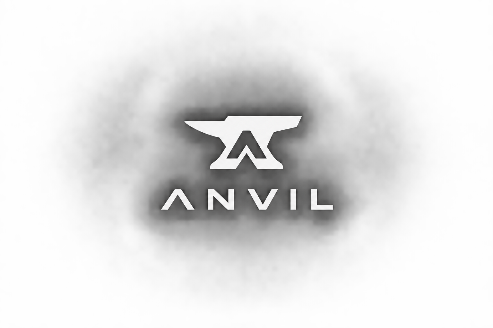

<p align="center">
  
</p>

<h3 align="center">Anchor → Pinocchio, with proof.</h3>

<p align="center">
  Transpile an Anchor program to a cargo-buildable Pinocchio project —<br>
  then prove the port is deploy-safe with a byte-equal gate that runs both inside a real VM.
</p>

<p align="center">
  <a href="https://www.npmjs.com/package/anvil-sol"></a>
  
  
  
</p>

<p align="center">
  <a href="https://anvilsol.xyz"><b>anvilsol.xyz</b></a> ·
  <a href="https://anvilsol.xyz/docs">Docs</a> ·
  <a href="https://www.npmjs.com/package/anvil-sol">npm</a> ·
  <a href="SECURITY.md">Security</a>
</p>

---

Most Anchor programs stay on Anchor not because anyone prefers it in production, but because hand-rewriting thousands of lines of Rust to a leaner runtime carries unacceptable correctness risk. Anvil removes that risk.

```bash
npm install -g anvil-sol

# 1 — migrate
anvil compile ./my-anchor-program --target pinocchio -o ./my-pinocchio

# 2 — prove it (builds BOTH .so, synthesizes a scenario, byte-compares in a VM)
anvil verify ./my-anchor-program
#   ✓ BYTE-EQUAL — all compared accounts match
```

## Why byte-equal

**Cargo green is necessary but not sufficient.** `anvil verify` builds your Anchor source **and** the emitted Pinocchio into separate `.so` files, replays the same instruction sequence against both inside [LiteSVM](https://github.com/litesvm/litesvm), and asserts the end state is byte-identical:

- **`data`** — every account's bytes after the full sequence
- **`lamports`** — balance deltas across signers, PDAs, vaults
- **`owner`** — the program each account is left assigned to

Anything else — wrong CPI account order, missing bump, off-by-one Borsh layout, an account left with the wrong owner, a dropped access-control check — **fails the gate loudly**. It also fires **negative probes** (unauthorized caller, missing signer) that must revert identically on both binaries, so access control is verified too. `emit!`, `set_return_data`, and `msg!` are opt-in comparison surfaces.

Drive the gate with your own scenarios: `anvil differential ./program --scenario s.json --fuzz 100`. Format in [docs/differential-testing.md](docs/differential-testing.md).

## Verified against real code

Externally-authored programs cloned verbatim from public repos, emit byte-identical to the Anchor reference under the same scenario:

- **klend** — 63 instructions, `cargo build-sbf` **GREEN**. First top Solana lending protocol fully compilable to Pinocchio.
- **Helium circuit-breaker** — 8 instructions across 12 source files. First multi-file real-world byte-equal.
- **Metaplex** — full MPL Token Metadata (11/12) and MPL Core (12/12) catalogs emit real CPIs, no stubs.
- **DeFi cohort** — marginfi-v2 (91 ix), raydium-clmm (34 ix) transpile and compile.
- **196 byte-equal differential test files** + **193 real-world cargo-green regression gates** run as the pre-release corpus.

<details>
<summary><b>14+ real-world Anchor programs verified byte-equal</b></summary>

| Program | Source | Surface |
|---|---|---|
| `anchor-escrow-2025` | mikemaccana/anchor-escrow-2025 | PDA + non-ATA token init + `token::transfer` |
| `coral-multisig` | coral-xyz/anchor test corpus | m-of-n signer enforcement |
| `coral-events` | coral-xyz/anchor test corpus | `emit!()` event log + multi-field borsh payload |
| `coral-composite` | coral-xyz/anchor test corpus | Composite `#[derive(Accounts)]` flatten |
| `coral-realloc` | coral-xyz/anchor test corpus | Vec resize with rent-delta accounting |
| `coral-overflow-checks` | coral-xyz/anchor test corpus | Overflow enforcement |
| `coral-duplicate-mutable` | coral-xyz/anchor test corpus | Mutable alias detection |
| `coral-pda-derivation` | coral-xyz/anchor test corpus | PDA derivation patterns |
| `coral-init-if-needed` | coral-xyz/anchor test corpus | `init_if_needed` constraint |
| `favorites` | solana-developers/program-examples | `init_if_needed` + `String` + `Vec<String>` (max_len) |
| `account-data` | solana-developers/program-examples | 3× `String` fields under `#[max_len(50)]` |
| `pda-rent-payer` | solana-developers/program-examples | Signer-seeded `system_program::create_account` |
| `program-examples counter` | solana-developers/program-examples | Basic PDA init + state mutation |
| `page-visits` | solana-developers/program-examples | Smallest possible PDA-init (5-byte struct) |

Plus 64 demo fixtures covering vaults, ATAs, SPL transfer/burn, Token-2022 `transfer_checked`, `close`, staking, AMM, multisig, realloc, vesting, `emit!`, sysvars, and the Token-2022 extension family. `bun test api/tests/differential-*.test.ts` runs the full set.

</details>

## Compute savings

Built both as the Anchor original and Anvil-emitted Pinocchio, deployed to `solana-test-validator`, measured side-by-side (best-of-5 trials). **Real numbers, not estimates:**

| Instruction | Anchor CU | Anvil-Pinocchio CU | Saved |
|---|---:|---:|---:|
| `vault::initialize` | 9,384 | 4,893 | **48%** |
| `counter::initialize` | 6,074 | 3,268 | **46%** |
| `escrow::create_escrow` | 26,614 | 16,133 | **39%** |
| `counter::increment` | 2,753 | 1,801 | **35%** |
| `vault::deposit` | 6,726 | 4,674 | **31%** |

SPL-heavy workloads save more — Helius's hand-written p-token measures 97–98% CU reduction on transfer/mint/burn, and Anvil's SPL emit uses the same builders. Reproduce with `bun scripts/measure-cu.ts`.

## CLI

```
anvil compile <input> --target <pinocchio|native> [-o <dir>]
anvil verify  <input> [--target <target>]          # one-shot byte-equal proof
anvil differential <input> [--scenario s.json] [--fuzz N]
anvil parse | validate | advise | refine | lint | bench | snapshot | diff <input> …
```

Safe-by-default since v0.4: `compile` refuses to declare success when the validator finds errors, the emit contains `TODO(manual)` markers, or `cargo check` rejects the output. `--permissive` / `--no-cargo-check` are the explicit opt-outs.

## Pipeline

```
Anchor source → tree-sitter → Solana IR (Zod, 100+ body kinds) → {Pinocchio, Native} emit → Validator
                                                  │
                                                  └──► Differential harness (LiteSVM byte-equal: data + lamports + owner)
```

One typed IR feeds the emitters, the lint / bench / snapshot / diff commands, the workbench, and the AI refine validator. No pass duplicates parsing. Detail: [docs/architecture.md](docs/architecture.md).

## Security audit (optional)

`anvil audit <input>` is an optional companion that scans your Anchor source **and** the transpiled output side by side, then reports the parity: weaknesses carried from source, findings with their coverage in the emit, and — the tripwire — any finding that exists **only on the output**, meaning the transformation may have dropped a guarantee. It caught a real missing owner/discriminator check in the Pyth path (fixed in 0.8.1).

> The audit is experimental and strongest on Anchor and Pinocchio code; native scanning is noisier. Anvil works fully without it. See [docs/audit-trust-model.md](docs/audit-trust-model.md).

## Project layout

```
api/    Bun + Express service: parse, emit, validate, build, AI refine, sandbox
cli/    anvil-sol — npm CLI, ships api/src bundled via prepack
web/    Next.js landing + docs
docs/   Architecture, differential testing, feature matrix, migration guide
```

## Status

**v0.9.0.** CLI runs on plain Node (`npm install -g anvil-sol`; Bun no longer required). Ships `anvil verify` (byte-equal proof with negative probes) and `anvil audit` (security parity). Live at [anvilsol.xyz](https://anvilsol.xyz). 196 byte-equal differential test files + 193 real-world cargo-green MUST_PASS gates + 100+ IR body kinds, run as the pre-release corpus (per-push CI typechecks). See [CHANGELOG.md](CHANGELOG.md).

## License

Apache 2.0 — see [LICENSE](LICENSE).

## Contributing

Issues and PRs welcome. Most useful: new differential fixtures (~30-line additions — see [docs/differential-testing.md](docs/differential-testing.md)), real-world Anchor programs that fail to transpile (file the source + the divergence), and workspace/multi-crate projects.
